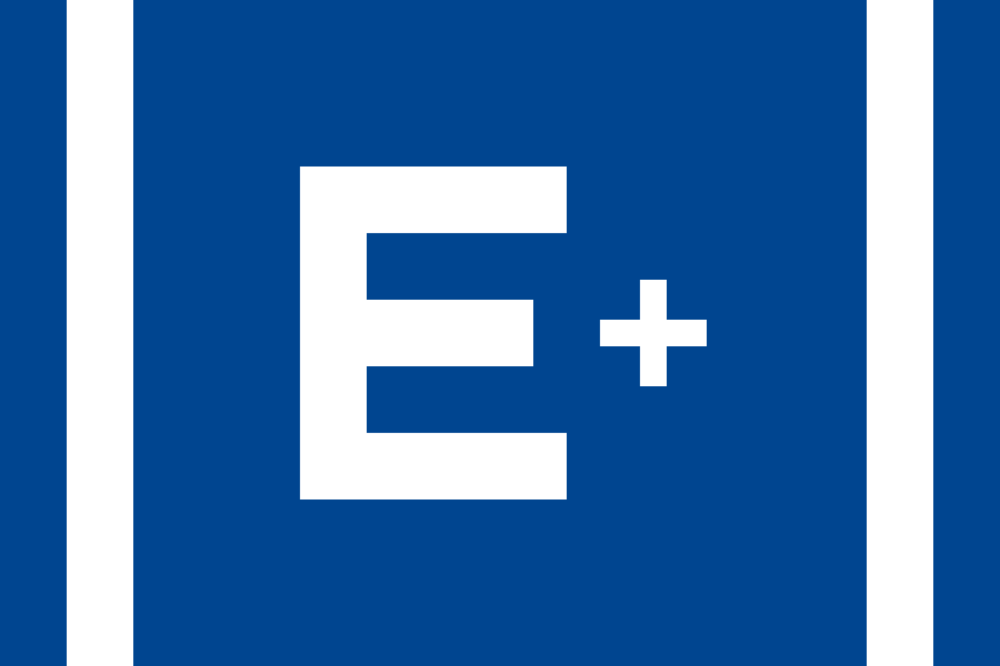
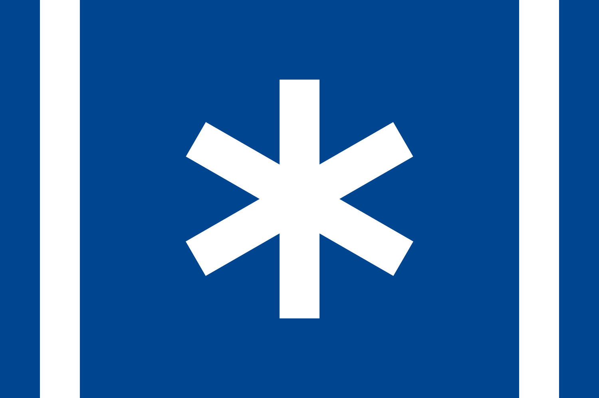

<html>
<head>
<!--
<meta charset="UTF-8">
<title>README MARKDOWN</title>
-->
</head>
<body>

<h1>Introduction of OSE</h1>
<table>
<tr>
<td>
<pre>
SES project was founded in November 14, 2018 (Later it was uploaded to
GitHub). Its name comes for the initials of Source of Erikrian Scripts.
SES is a part of OSE project, aimed to store scripts or configure files
of Erikria. Absolutely, SES and OSE, or "Open Source Erikria", are both
essential projects in the plan of Erikrian Plus. In SES, all files are
under the GNU Public License, and its current maintainer is Ren Tergan.
</pre>
</td>
<th>

</th>
</tr>
<tr>
<td>
<pre>
The CREE project, or Cascading Resources of Erikrian Electronics, is a
collection of frequently-used websites of Erikria. As one of the oldest
project in Erikria, CREE was initialized at the MS-DOS period. The main
content of CREE is stored in a file named "Cree.htm", and with the evo-
lution of SES, "Cree.htm" can now be generated automatically. Normally,
any file contains contents from "Cree.htm" will be licensed under GPL.
</pre>
</td>
<th>

</th>
</tr>

</table>

<h2>Directories List</h2>
<table>
<tr>
<th>Directory</th>
<th>Description</th>
<th>Files Amount</th>
<!--
<th rowspan="6">

</th>
-->
</tr>
<tr>
<td>BSH</td>
<td>Directory for Bash Scripts</td>
<td>16</td>
</tr>
<tr>
<td>CSV</td>
<td>Directory for Databases</td>
<td>14</td>
</tr>
<tr>
<td>HTM</td>
<td>Directory for CSS and HTML files</td>
<td>14</td>
</tr>
<tr>
<td>SVG</td>
<td>Directory for SVG graphics</td>
<td>14</td>
</tr>
<tr>
<td>TEX</td>
<td>Directory for LaTeX and Perl</td>
<td>12</td>
</tr>
<tr>
<td>VIM</td>
<td>Directory for configure files</td>
<td>16</td>
</tr>
</table>
</body>
</html>
